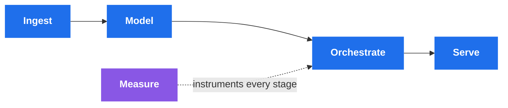

<h1 align="center">Sarra Bouden</h1>

  <b>Data Engineer</b> · Bac+5 ESPRIT (CTI / EUR-ACE) · 6-month internship at Mercedes-Benz AG, Sindelfingen

  <i>I build the data infrastructure — and because I built the evaluation harness for a 
  production LLM system at Mercedes-Benz, I can also prove the AI layer on top of it works.</i>

  
  
  

---

### What I build

Get data in, model it so it means something, run it on a schedule that can be trusted, and put it where people can use it. The purple box is the one most people skip: **whatever sits on top — a dashboard, a model, an LLM system — I want a way to tell whether it's actually working.**

---

### Stack

**Core**

  
  
  
  
  
  

**Streaming & platform**

  
  
  
  
  
  
  
  

**AI engineering**

  
  
  
  
  

---

### Mercedes-Benz AG — Sindelfingen · 6-month internship

<table>
<tr>
<td width="25%" align="center"><b>500+</b> modules ingested</td>
<td width="25%" align="center"><b>11</b> agent LangGraph pipeline</td>
<td width="25%" align="center"><b>31</b> tests on the MCP server</td>
<td width="25%" align="center"><b>81%</b> retrieval precision, measured</td>
</tr>
</table>

Multi-format document ingestion (PDF · HTML · C · SVG · Simulink) feeding a multi-agent GraphRAG system, exposed through an MCP server (fastmcp, FastAPI, SSE). The part I care about most is the last column: a RetrievalTrace instrumentation layer, a 35-question gold-standard dataset and LLM-as-judge scoring — so the 81% is a measurement, not an impression.

---

### Projects

<table>
<tr>
<td width="50%" valign="top">

#### 🔵 [realtime-cdc-pipeline](https://github.com/sarahbouden/realtime-cdc-pipeline)
Postgres WAL → analytical warehouse via change data capture.

`Debezium` `Kafka` `Flink` `DuckDB` `dbt` `Airflow` `Grafana` `Terraform`

</td>
<td width="50%" valign="top">

#### 🔵 [financial-transactions-platform](https://github.com/sarahbouden/financial-transactions-platform)
Dual-write streaming ingestion into a 3-layer warehouse, **28 dbt tests**, CI on every PR.

`Kafka` `Pub/Sub` `S3` `BigQuery` `dbt` `Airflow` `Actions` `Prometheus`

</td>
</tr>
<tr>
<td width="50%" valign="top">

#### 🟣 [fake-news-detection](https://github.com/sarahbouden/fake-news-detection)
Multi-agent claim verification graph with conditional routing and an explicit error path.

`LangGraph` `Groq` `FastAPI` `sentence-transformers`

</td>
<td width="50%" valign="top">

#### 🟣 [ContractScan](https://github.com/sarahbouden/ContractScan)
Clause-level contract comparison, human-in-the-loop, LLM fully local — no document leaves the machine.

`Ollama/Mistral` `LangChain` `Streamlit` `FPDF2`

</td>
</tr>
</table>

> Both data engineering projects are self-built portfolio systems, not production systems operated under load. Each README says so explicitly, and lists its own limits.

---

### Currently working on

`timed SQL` &nbsp;·&nbsp; `dimensional modelling write-ups` &nbsp;·&nbsp; `streaming semantics — ordering, delivery guarantees, schema evolution, replay`

  Open to Data Engineering and Analytics Engineering roles in Europe · visa sponsorship required

